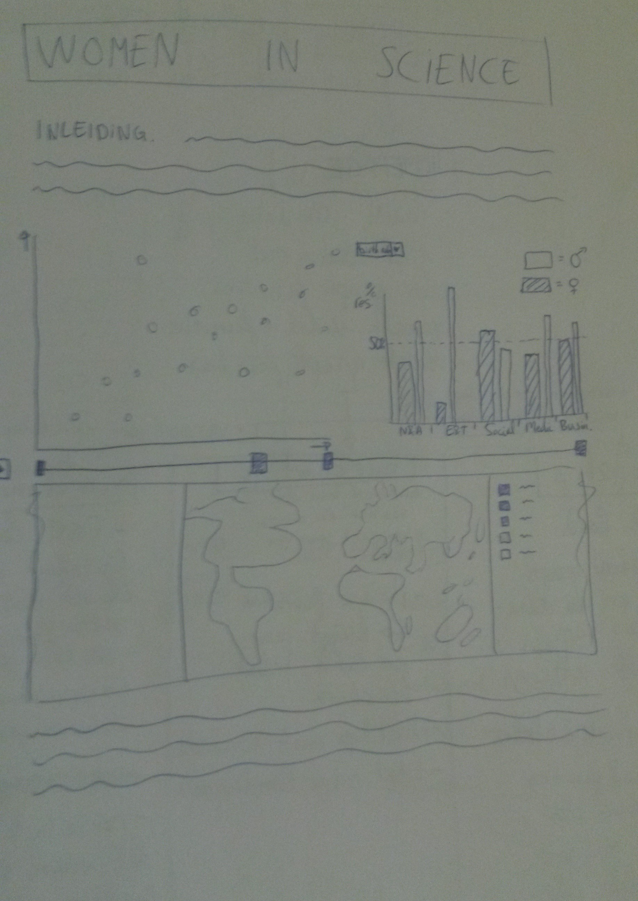

### Basic overview van de visualisaties tov elkaar, plus interactie elementen (slider en dropdown menu)

### Inrichting van index.html, wat wordt aangeroepen en welke elementen erin staan, onderverdeling en interactie tussen javascript files, voor index, scatterplot, barchart en world map

