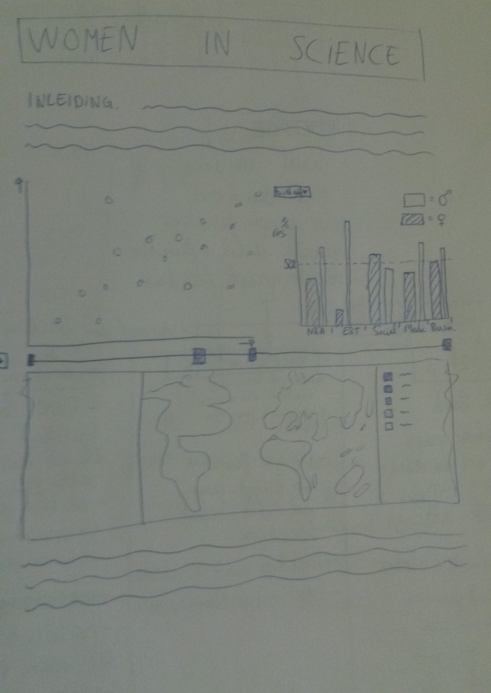

# Week 1, Day 1
Vandaag vooral de data uitgezocht die ik wil gebruiken. Nog veel nagedacht over een evt ander doel (jonge vrouwen inspireren om onderzoek in te gaan, zou moeten mbv timeline maar weet niet of dit haalbaar is). Veel geschetst en gelijst

# Week 1, Day 2
Besloten om mijn originele verhaling vast te houden (laten zien van de gender gap). Vervolgens eerdere HTML en JS files opgedoken om weer even het geheugen op te frissen. Ook eerste poging gedaan tot data processing in Python. Hier moet ik morgen een beter systeem voor bedenken.

# Week 1, Day 3
Vandaag heb ik de opbouw van mijn verhaal omgegooid waardoor de elementen een veel compacter en concreter verhaal vertellen. Mijn primaire element wordt nu de scatterplot (ipv de wereldkaart), waar per land een bolletje aangeeft wat de % vrouwen in onderzoek (x-as) en % vrouwen met een baan (y-as) zijn. De y-variabele is te veranderen door de gebruiker naar birth rate van een land en % uitgave aan educatie door de overheid. Klikken op een bolletje geeft een barchart voor dit land met daarin de verdeling man-vrouw per vakgebied in onderzoek.
Onder deze twee visualisaties is een time slider met een play-button waarmee over de tijd kan worden gekeken. Hieronder is een wereldkaart te zien, ingekleurd op % vrouwen in onderzoek, met een legenda. Zowel de scatterplot, bar chart als de wereldkaart reageert op de time slider.

Basic sketch van de indeling van deze elementen over de pagina:

Ik heb een overzicht schets gemaakt (DESIGN.md) met de verschillende scripts, waar wat wordt aangeroepen en welke elementen in de main page HTML file al zullen staan. Ook heb ik al een aantal dingen geprobeerd mbt stijl en de slider knop ingebouwd (library d3.slider.js).

Inspiratie voor slider en play-button: http://bl.ocks.org/darrenjaworski/5544599
Slider examples, voor evt variatie: http://thematicmapping.org/playground/d3/d3.slider/

# Week 1, Day 4
Vandaag heb ik de hele dag gedaan over het downloaden van mijn data. Beetje jammer, maar uiteindelijk wel gelukt. Unesco is niet bepaald een aanrader voor megagrote datasets.

# Week 1, Day 5
Vandaag presenteerden we onze prototypes voor een groep. Ik heb een begin gemaakt aan een pythonscript wat mijn data processed, dit blijkt nog enorm ingewikkeld (zeker wegens de ingewikkelde JSON structuur en de grote hoeveelheid gaten in mijn data). Op het design en interactieve elementen werd goed gereageerd door de groep en hier ben ik inmiddels ook volledig tevreden over.

# Week 2, Day 1
Vandaag ben ik verder gegaan aan het processen van mijn data. Hier veel frustratie over. Ik heb alle lege velden een 0 gegeven, aangezien geen van de werkelijke datawaarden 0 was. Hierdoor is het iets makkelijker te verwerken dan met lege strings, die door verschillende talen verschillend worden geinterpreteerd (en dus geen geldige JSON opleveren). Ook heb ik een eerste poging gedaan om de data in datamaps te laden, dit lukt echter nog niet. Ik moet er waarschijnlijk een andere vorm aan geven om het mogelijk te maken.
Ook een poging gedaan tot versimpelde datasets voor 1 jaar een fillkey per jaar. Even kijken of dit misschien iets oplevert...

