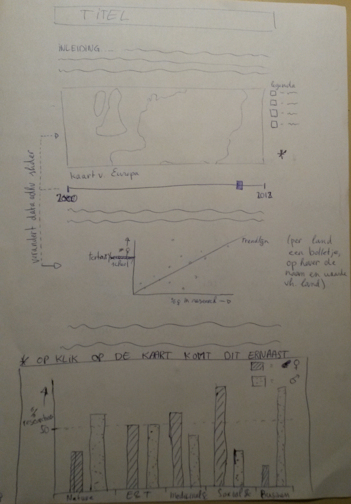

# Programmeerproject

## Vrouwen in het onderzoek: waar zijn ze?

#### Doel

Deze visualisatie bekijkt de man-vrouw verhouding in het onderzoek in Europa over tijd, vakgebied en sector. Het is bedoeld om een beeld te krijgen van de genderdiversiteit in het onderzoek vanuit verschillende invalshoeken, en te bepalen of er werkelijk een trend richting genderbalans te zien is.

#### Features

- Kaart van Europa, kleurgecodeerd voor het percentage vrouwen werkzaam in onderzoek (breedste zin van het woord). Op hover-over van een land wordt de naam en waarde van dat land laten zien. Onder de kaart zal een slider staan om te schuiven over de tijd (2000 - 2012). Op klikken van een land zal een tweede visualisatie over dat specifieke land verschijnen.
- Bar chart, verschijnt bij het klikken van een land. Laat percentage vrouwen zien (met een 50% lijn als indicatie van genderbalans) in verschillende vakgebieden. Op hover wordt de waarde van die balk laten zien. Een drop-down menu laat de gebruiker kiezen tussen sectoren waar de data van wordt weergegeven.
- Scatterplot van alle landen, die het percentage vrouwen werkzaam in de wetenschap tegenover het percentage van vrouwen die een tertiaire opleiding hebben afgerond weergeeft. Bij klikken op een land wordt het bolletje van dit land in de scatterplot gehighlight.
- Optionele toevoeging: Lijst met vrouwelijke wetenschappers afkomstig uit het land waarop geklikt is. Naam, geboortejaar, vakgebied en eventuele onderscheiding(en)

Eerste sketch: 

#### Databases

- Unesco Institute for Statistics
- Worldbank
- Eurostat
- Optioneel: Wikipedia / Britannica

#### Decomposing

Ten eerste moet de kaart correct worden gecodeerd in kleur obv de data. Deze data moet vervolgens adhv de slider aangepast worden. De scatterplot kan worden geplot adhv een eigen dataset en reageert alleen bij het klikken van een land. Tenslotte zal bij het klikken van een land de barchart geplot moeten worden met desbetreffende data. Ook deze zal bij aanpassen van de slider moeten worden aangepast.
Voor deze visualisaties is minimaal D3 nodig.
Een eventuele beperking van de beschikbare data is de inconsistentie van de beschikbaarheid van data over de tijdslijn. Dit kan de vertelling van de visualisaties enigszins in de weg zitten. Als dit een groot probleem blijkt, kan er gekozen worden voor een kortere tijdspan, wat de kans op volledige data vergroot.

#### Eerdere visualizaties

Een eerdere visualizatie die als inspiratie heeft gediend is afkomstig van Unesco Institute for Statistics (http://www.uis.unesco.org/_LAYOUTS/UNESCO/women-in-science/index.html#!lang=en). Deze visualisatie kijkt wereldbreed naar de verhouding tussen mannen en vrouwen in verschillende onderzoeksvelden en onderwijsniveaus. De visualisatie is mooi vormgegeven, maar bevat enorm veel data. Hierdoor is het moeilijk om te vergelijken tussen landen. Concrete conclusies over een land zijn eveneens moeilijk te trekken. Mooi aan deze visualisatie vind ik wel de beschrijving van de 'educational pipeline'. Dit zou nog meer belicht kunnen worden door hier een wat verhalendere visual van te maken.

#### Minimum Viable Product

De MVP zal bestaan uit de kaart van Europa, waar gekozen kan worden voor data van meerdere jaren (mbv een dropdown menu / checking boxes / slider). Bij klikken van een land wordt de barchart weergegeven, met data over de sector 'higher education'. Via dropdown menu kan voor een andere sector worden gekozen. Ook wordt een scatterplot laten zien waarop voor alle landen de data van het meest recente weergegeven jaar wordt weergegeven. Bij hover-over wordt de naam van het land weergegeven. Dit alles zal door een coherent verhaal omgeven worden en een geheel vormen.

# day 2
Besloten om mijn originele verhaling vast te houden (laten zien van de gender gap). Vervolgens eerdere HTML en JS files opgedoken om weer even het geheugen op te frissen. Ook eerste poging gedaan tot data processing in Python. Hier moet ik morgen een beter systeem voor bedenken.
